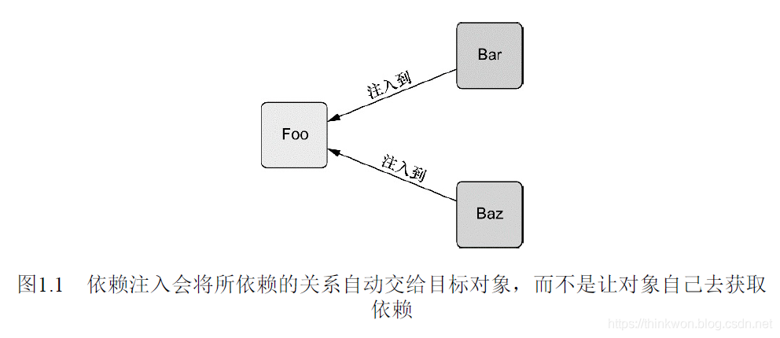
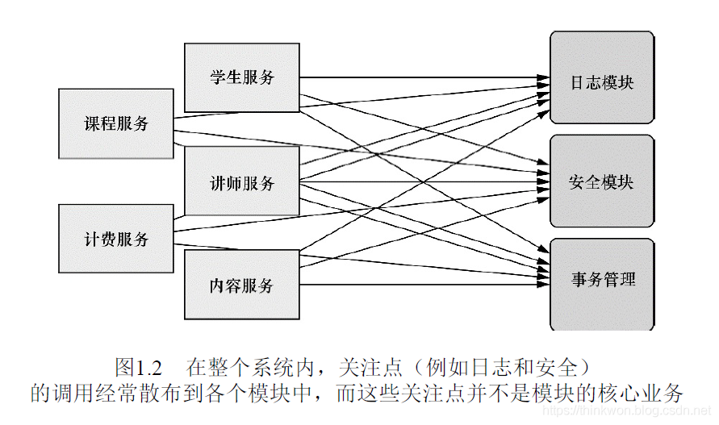
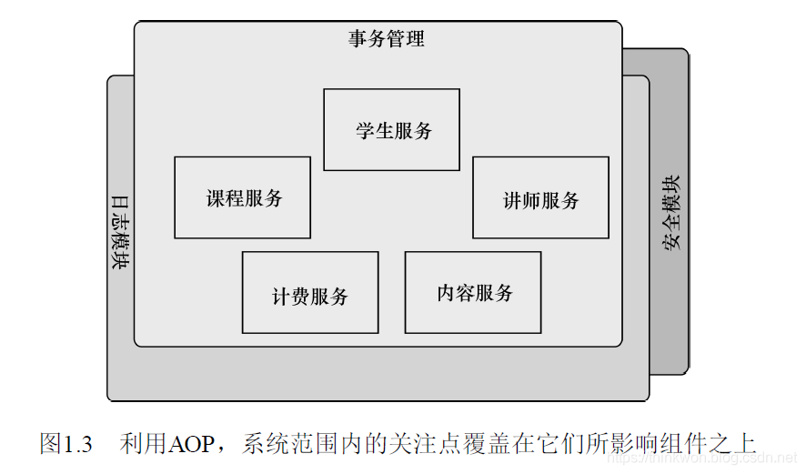
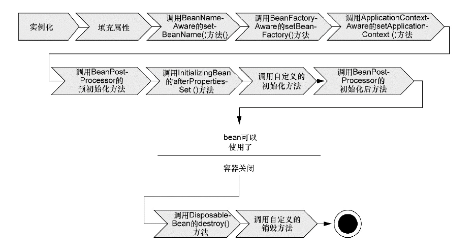
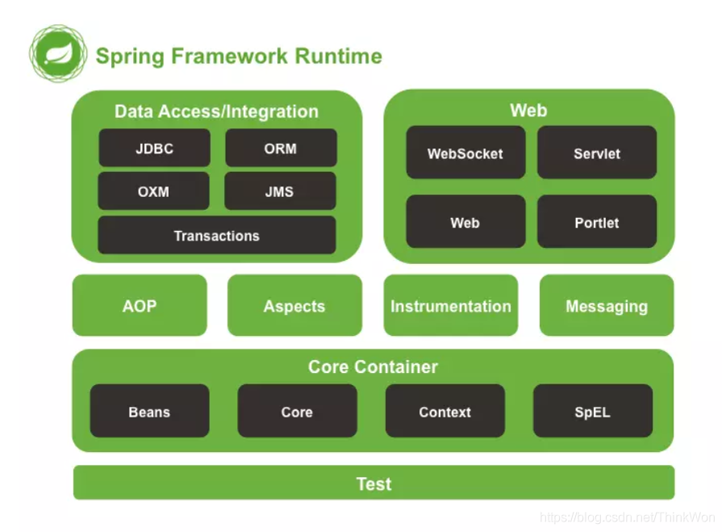

# 1.Spring 概览

## 1.1 简化Java开发

Spring是一个开源框架，最早由Rod Johnson创建，并在《Expert One-on-One：J2EE Design and Development》这本著作中进行了介绍。

纵览全书，读者会发现Spring可以做非常多的事情。但归根结底，支撑Spring的仅仅是少许的基本理念，所有的理念都可以追溯到Spring最根本的使命上：解决企业级应用开发的复杂性，即简化Java开发。

Spring是如何简化Java开发的？为了降低Java开发的复杂性，Spring采取了以下4种关键策略：

1. 基于POJO（Plain Old Java Object）的轻量级和最小侵入性编程； 

2. 通过**依赖注入**（dependency injection，DI）和面向接口实现松耦合； ***组件之间松耦合***

3. 基于**切面**和惯例进行声明式编程； ***高内聚和POJO的简单性***

4. 通过切面和**模板**减少样板式代码。 

几乎Spring所做的任何事情都可以追溯到上述的一条或多条策略，其保证了Java应用的简单性、可测试性和松耦合。

### 1.1.1 激发POJO的潜能 

如果你从事Java编程有一段时间了，那么你或许会发现（可能你也实际使用过）很多框架通过强迫应用继承它们的类或实现它们的接口从而导致应用与框架绑死。一个典型的例子是EJB 2时代的无状态会话bean。早期的EJB是一个很容易想到的例子，不过这种侵入式的编程方式在早期版本的Struts、WebWork、Tapestry以及无数其他的Java规范和框架中都能看到。

Spring竭力避免因自身的API而弄乱你的应用代码。Spring不会强迫你实现Spring规范的接口或继承Spring规范的类，相反，在基于Spring构建的应用中，它的类通常没有任何痕迹表明你使用了Spring。最坏的场景是，**一个类或许会使用Spring注解**，但它依旧是POJO。

Spring的**非侵入编程模型**意味着这个类在Spring应用和非Spring应用中都可以发挥同样的作用。

### 1.1.2 依赖注入 

> 依赖注入
>
> 控制反转
>
> 装配：XML配置文件、Java配置 / 创建、配置、组装对象
>
> 上下文context：

Spring可以做很多事情，它为企业级开发提供给了丰富的功能，但是这些功能的底层都依赖于它的两个核心特性，也就是依赖注入和面向切面编程。

依赖注入这个词让人望而生畏，现在已经演变成一项复杂的编程技巧或设计模式理念。但事实证明，依赖注入并不像它听上去那么复杂。在项目中应用DI，你会发现你的代码会变得异常简单并且更容易理解和测试。

**DI功能是如何实现的**

任何一个有实际意义的应用（肯定比Hello World示例更复杂）都会由两个或者更多的类组成，这些类相互之间进行协作来完成特定的业务逻辑。按照传统的做法，每个对象负责管理与自己相互协作的对象（即它所依赖的对象）的引用，这将会导致高度耦合和难以测试的代码。

耦合具有两面性（two-headed beast）。一方面，紧密耦合的代码难以测试、难以复用、难以理解，并且典型地表现出“打地鼠”式的bug特性（修复一个bug，将会出现一个或者更多新的bug）。另一方面，一定程度的耦合又是必须的——完全没有耦合的代码什么也做不了。为了完成有实际意义的功能，不同的类必须以适当的方式进行交互。总而言之，**耦合是必须的，但应当被小心谨慎地管理**。

通过DI，对象的依赖关系将由系统中负责协调各对象的第三方组件在创建对象的时候进行设定。对象无需自行创建或管理它们的依赖关系，如图1.1所示，依赖关系将被自动注入到需要它们的对象当中去。



依赖注入会将所依赖的关系自动交给目标对象，而不是让对象自己去获取依赖。

**创建应用组件之间协作的行为通常称为装配（wiring）**。Spring有多种装配bean的方式，采用XML是很常见的一种装配方式。如果XML配置不符合你的喜好的话，Spring还支持使用Java来描述配置。

**观察它如何工作**

Spring通过应用上下文（Application Context）装载bean的定义并把它们组装起来。Spring应用上下文全权负责对象的创建和组装。Spring自带了多种应用上下文的实现，它们之间主要的区别仅仅在于**如何加载配置**。

### 1.1.3 应用切面 

>  DI能够让相互协作的软件组件保持松散耦合，而面向切面编程（aspect-oriented programming，AOP）允许你把遍布应用各处的功能分离出来形成可重用的组件。

面向切面编程往往被定义为促使软件系统实现关注点的分离一项技术。系统由许多不同的组件组成，每一个组件各负责一块特定功能。除了实现自身核心的功能之外，这些组件还经常承担着额外的职责。诸如日志、事务管理和安全这样的系统服务经常融入到自身具有核心业务逻辑的组件中去，这些**系统服务**通常被称为**横切关注点**，因为它们会跨越系统的多个组件。如果将这些关注点分散到多个组件中去，你的代码将会带来双重的复杂性。

* 实现系统关注点功能的代码将会重复出现在多个组件中。这意味着如果你要改变这些关注点的逻辑，必须修改各个模块中的相关实现。即使你把这些关注点抽象为一个独立的模块，其他模块只是调用它的方法，但方法的调用还是会重复出现在各个模块中。
* 组件会因为那些与自身核心业务无关的代码而变得混乱。一个向地址簿增加地址条目的方法应该只关注如何添加地址，而不应该关注它是不是安全的或者是否需要支持事务。 



上图展示了这种复杂性。左边的业务对象与系统级服务结合得过于紧密。每个对象不但要知道它需要记日志、进行安全控制和参与事务，还**要亲自执行这些服务**。在整个系统内，关注点（例如日志和安全）的调用经常散布到各个模块中，而这些关注点并不是模块的核心业务。

AOP能够使这些服务模块化，并以声明的方式将它们应用到它们需要影响的组件中去。所造成的结果就是这些组件会具有**更高的内聚性并且会更加关注自身的业务，完全不需要了解涉及系统服务所带来复杂性**。总之，AOP能够确保POJO的简单性。

如下图所示，我们可以把切面想象为覆盖在很多组件之上的一个外壳。应用是由那些实现各自业务功能的模块组成的。借助AOP，可以使用各种功能层去包裹核心业务层。这些层以声明的方式灵活地应用到系统中，你的核心应用甚至根本不知道它们的存在。这是一个非常强大的理念，可以将安全、事务和日志关注点与核心业务逻辑相分离。



### 1.1.4 使用模板消除样板式代码 

你是否写过这样的代码，当编写的时候总会感觉以前曾经这么写过？我的朋友，这不是似曾相识。这是样板式的代码（boilerplate code）。通常为了实现通用的和简单的任务，你不得不一遍遍地重复编写这样的代码。遗憾的是，它们中的很多是因为使用Java API而导致的样板式代码。样板式代码的一个常见范例是**使用JDBC访问数据库**查询数据。Spring旨在通过模板封装来消除样板式代码，如`JdbcTemplate`封装了JDBC重复代码。

## 1.2 容纳你的Bean 

> 理解容器有助于理解对象是如何被管理的

在Spring应用中，对象生存于Spring容器（container）中。Spring容器负责创建对象，装配它们，配置它们并管理它们的整个生命周期，从生存到死亡（在这里，可能就是new到finalize()）。**容器是Spring框架的核心**，其使用DI管理构成应用的组件，它会创建相互协作的组件之间的关联。毫无疑问，这些对象更简单干净，更易于理解，更易于重用并且更易于进行单元测试。

Spring容器并不是只有一个。Spring自带了多个容器实现，可以归为两种不同的类型。

* bean工厂（由`org.springframework.beans.factory.BeanFactory`接口定义）是最简单的容器，提供基本的DI支持。
* 应用上下文 （由`org.springframework.context.ApplicationContext`接口定义）基于BeanFactory构建，并提供应用框架级别的服务，例如**从属性文件解析文本信息**以及**发布应用事件给感兴趣的事件监听者**。

虽然我们可以在bean工厂和应用上下文之间任选一种，但bean工厂对大多数应用来说往往太低级了，因此，应用上下文要比bean工厂更受欢迎。我们会把精力集中在应用上下文的使用上，不再浪费时间讨论bean工厂。

### 1.2.1 使用应用上下文 

Spring自带了多种类型的应用上下文。下面罗列的几个是你最有可能遇到的。

* `AnnotationConfigApplicationContext`：从一个或多个**基于Java的配置类**中加载Spring应用上下文。
* `AnnotationConfigWebApplicationContext`：从一个或多个**基于Java的配置类**中加载Spring Web应用上下文。
* `ClassPathXmlApplicationContext`：从***类路径***下的一个或多个**XML配置文件**中加载上下文定义，把应用上下文的定义文件作为类资源。 
* `FileSystemXmlapplicationcontext`：从***文件系统***下的一个或多个**XML配置文件**中加载上下文定义。 
* `XmlWebApplicationContext`：从Web应用下的一个或多个**XML配置文件**中加载上下文定义。 

```java
ApplicationContext context = new FileSystemXmlApplicationContext("./knight.cml");
ApplicationContext context = new ClassPathXmlApplicationContext("knight.xml");
ApplicationContext context = new AnnotationConfigApplicationContext(KnightConfig.class);
```


### 1.2.2 bean的生命周期 

可以参考Spring容器中bean的生命周期

在传统的Java应用中，bean的生命周期很简单。使用Java关键字new进行bean实例化，然后该bean就可以使用了。一旦该bean不再被使用，则由Java自动进行垃圾回收。相比之下，Spring容器中的bean的生命周期就显得相对复杂多了。正确理解Spring bean的生命周期非常重要，因为你或许要利用Spring提供的扩展点来自定义bean的创建过程。下图展示了bean装载到Spring应用上下文中的一个典型的生命周期过程。



bean在Spring容器中从创建到销毁经历了若干阶段，每一阶段都可以针对Spring如何管理bean进行个性化定制。正如你所见，在bean准备就绪之前，bean工厂执行了若干启动步骤。我们对上图进行详细描述：

1. Spring对bean进行实例化；

2. Spring将值和bean的引用注入到bean对应的属性中； 

3. **如果bean实现了BeanNameAware接口，Spring将bean的ID传递给setBean-Name()方法；** 

4. **如果bean实现了BeanFactoryAware接口，Spring将调用setBeanFactory()方法，将BeanFactory容器实例传入；** 

5. **如果bean实现了ApplicationContextAware接口，Spring将调用setApplicationContext()方法，将bean所在的应用上下文的引用传入进来；** 

6. 如果bean实现了BeanPostProcessor接口，Spring将调用它们的post-ProcessBeforeInitialization()方法；

7.  如果bean实现了InitializingBean接口，Spring将调用它们的after-PropertiesSet()方法。类似地，如果bean使用initmethod声明了初始化方法，该方法也会被调用； 

8. 如果bean实现了BeanPostProcessor接口，Spring将调用它们的post-ProcessAfterInitialization()方法；

9.  此时，bean已经准备就绪，可以被应用程序使用了，它们将一直驻留在应用上下文中，直到该应用上下文被销毁； 

10. 如果bean实现了DisposableBean接口，Spring将调用它的destroy()接口方法。同样，如果bean使用destroy-method声明了销毁方法，该方法也会被调用。 

现在你已经了解了如何创建和加载一个Spring容器。但是一个空的容器并没有太大的价值，在你把东西放进去之前，它里面什么都没有。为了从Spring的DI(依赖注入)中受益，我们必须将应用对象装配进Spring容器中。

## 1.3 俯瞰Spring风景线 

正如你所看到的，Spring框架关注于通过DI、AOP和消除样板式代码来简化企业级Java开发。即使这是Spring所能做的全部事情，那Spring也值得一用。但是，Spring实际上的功能超乎你的想象。在Spring框架的范畴内，你会发现Spring简化Java开发的多种方式。但在Spring框架之外还存在一个构建在核心框架之上的庞大生态圈，它将Spring扩展到不同的领域，例如Web服务、REST、移动开发以及NoSQL。首先让我们拆开Spring框架的核心来看看它究竟为我们带来了什么，然后我们再浏览下Spring Portfolio中的其他成员。

### 1.3.1 [Spring模块](https://blog.csdn.net/ThinkWon/article/details/102810819)

这里只简单介绍Spring模块，具体的可以查看Spring模块组成(框架组成、整体架构、体系架构、体系结构)

Spring 总共大约有 20 个模块， 由 1300 多个不同的文件构成。 而这些组件被分别整合在核心容器（Core Container） 、 AOP（Aspect Oriented Programming）和设备支持（Instrmentation） 、数据访问与集成（Data Access/Integeration） 、 Web、 消息（Messaging） 、 Test等 6 个模块中。 以下是 Spring 5 的模块结构图：



### 1.3.2 Spring Portfolio 

当谈论Spring时，其实它远远超出我们的想象。事实上，Spring远不是Spring框架所下载的那些。如果仅仅停留在核心的Spring框架层面，我们将错过Spring Portfolio所提供的巨额财富。整个Spring Portfolio包括多个构建于核心Spring框架之上的框架和类库。概括地讲，整个Spring Portfolio几乎为每一个领域的Java开发都提供了Spring 编程模型。

或许需要几卷书才能覆盖Spring Portfolio所提供的所有内容，这也远远超出了本书的范围。不过，我们会介绍Spring Portfolio中的一些项目，同样，我们将体验一下核心框架之外的另一番风景。

Spring Portfolio主要包括如下项目，这里不一一介绍Spring Web Flow，Spring Web Service，Spring Security，Spring Integration，Spring Batch，Spring Data，Spring Social，Spring Mobile，Spring for Android，Spring Boot等，感兴趣的小伙伴可以自行研究。

**Spring Security**

安全对于许多应用都是一个非常关键的切面。利用Spring AOP，Spring Security为Spring应用提供了声明式的安全机制。

**Spring Integration**

许多企业级应用都需要与其他应用进行交互。Spring Integration提供了多种通用应用集成模式的Spring声明式风格实现。

**Spring Data**

Spring Data使得在Spring中使用任何数据库都变得非常容易。尽管关系型数据库统治企业级应用多年，但是现代化的应用正在认识到并不是所有的数据都适合放在一张表中的行和列中。一种新的数据库种类，通常被称之为NoSQL数据库，提供了使用数据的新方法，这些方法会比传统的关系型数据库更为合适。

不管你使用文档数据库，如MongoDB，图数据库，如Neo4j，还是传统的关系型数据库，Spring Data都为持久化提供了一种简单的编程模型。这包括为多种数据库类型提供了一种自动化的Repository机制，它负责为你创建Repository的实现。

**Spring Boot**

Spring极大地简化了众多的编程任务，减少甚至消除了很多样板式代码，如果没有Spring的话，在日常工作中你不得不编写这样的样板代码。Spring Boot是一个崭新的令人兴奋的项目，它以Spring的视角，致力于简化Spring本身。

Spring Boot大量依赖于自动配置技术，它能够消除大部分（在很多场景中，甚至是全部）Spring配置。它还提供了多个Starter项目，不管你使用Maven还是Gradle，这都能减少Spring工程构建文件的大小。

# 2.依赖注入和控制反转

## 2.1 控制反转

> 控制反转即 IoC (Inversion of Control)，它把传统上由程序代码直接操控的对象的调用权交给容器，通过容器来实现对象组件的装配和管理。所谓的“控制反转”概念就是对组件对象控制权的转移，从**程序代码本身**转移到了**外部容器**。

**作用**：

* 管理对象的创建和依赖关系的维护。对象的创建并不是一件简单的事，在对象关系比较复杂时，如果依赖关系需要程序猿来维护的话，那是相当头疼的
* 解耦，由容器去维护具体的对象
* 托管了类的产生过程，比如我们需要在类的产生过程中做一些处理，最直接的例子就是代理，如果有容器程序可以把这部分处理交给容器，应用程序则无需去关心类是如何完成代理的

**实现**：

* 依赖注入

  1. 接口注入（Interface Injection）

     ```java
     public interface UserMapper {
         void createUserMapper(UserMapper userMapper);
         void test();
     }
     
     public interface UserService {
         void test();
     }
     
     public class UserServiceImpl implements UserService, UserMapper {
         private UserMapper userMapper;
     
         @Override
         public void createUserMapper(UserMapper userMapper) {
             this.userMapper = userMapper;
         }
     
         @Override
         public void test() {
             userMapper.test();
         }
     }
     ```

  2. Setter方法注入（Setter Injection）

     ```java
     public class UserServiceImpl implements UserService {
         private UserMapper userMapper;
     
         /**
          * setter方法注入
          * @param userMapper
          */
         public void setUserMapper(UserMapper userMapper) {
             this.userMapper = userMapper;
         }
     
         @Override
         public void test() {
             userMapper.test();
         }
     }
     ```

  3. 构造器注入（Constructor Injection）

     ```java
     public class UserServiceImpl implements UserService {
         private UserMapper userMapper;
     
         /**
          * 构造方法注入
          * @param userMapper
          */
         public UserServiceImpl(UserMapper userMapper) {
             this.userMapper = userMapper;
         }
     
         @Override
         public void test() {
             userMapper.test();
         }
     }
     ```

     

* 依赖查找

  1. 上下文依赖查找(Contextualized Dependency Lookup) 
  
     ```Java
     public class UserServiceImpl {
         private DataSource dataSource;
         private UserMapper userMapper;
     
         public UserServiceImpl(){
             Context context = null;
             try{
                 context = new InitialContext();
                 dataSource = (DataSource) context.lookup("java:com/jourwon/dataSourceName");
                 userMapper = (UserMapper) context.lookup("java:com/jourwon/UserMapperName");
             } catch (Exception e) {
     
             }
         }
     }
     ```
  
     
  
  2. 依赖拖拽 (Dependency Pull)
  
     ```java
     public class UserServiceTest {
     
         public static void main(String[] args) {
             ClassPathXmlApplicationContext classPathXmlApplicationContext = new ClassPathXmlApplicationContext("classpath:spring-ioc.xml");
             UserServiceImpl userService = (UserServiceImpl) classPathXmlApplicationContext.getBean("UserServiceImpl");
             userService.test();
         }
     }
     ```
  
     

## 2.2 Spring装配Bean的可选方案

创建应用对象之间协作关系的行为通常称为装配（wiring），这是依赖注入（DI）的本质。在Spring中，对象无需自己查找或创建与其所关联的其他对象。相反，容器负责把需要相互协作的对象引用赋予各个对象。例如，一个订单管理组件需要信用卡认证组件，但它不需要自己创建信用卡认证组件。订单管理组件只需要表明自己两手空空，容器就会主动赋予它一个信用卡认证组件。

Spring容器负责创建应用程序中的bean并通过DI来协调这些对象之间的关系。但是，作为开发人员，你需要告诉Spring要创建哪些bean并且如何将其装配在一起。当描述bean如何进行装配时，Spring具有非常大的灵活性，它提供了三种主要的装配机制：

* 在XML中进行显式配置。

* 在Java中进行显式配置。

* 隐式的bean发现机制和自动装配。

乍看上去，提供三种可选的配置方案会使Spring变得复杂。每种配置技术所提供的功能会有一些重叠，所以在特定的场景中，确定哪种技术最为合适就会变得有些困难。但是，不必紧张——在很多场景下，选择哪种方案很大程度上就是个人喜好的问题，你尽可以选择自己最喜欢的方式。

Spring有多种可选方案来配置bean，这是非常棒的，但有时候你必须要在其中做出选择。这方面，并没有唯一的正确答案。你所做出的选择必须要适合你和你的项目。而且，谁说我们只能选择其中的一种方案呢？Spring的配置风格是可以互相搭配的，所以你可以选择使用XML装配一些bean，使用Spring基于Java的配置（JavaConfig）来装配另一些bean，而将剩余的bean让Spring去自动发现。

即便如此，我的建议是尽可能地使用自动配置的机制。显式配置越少越好。当你必须要显式配置bean的时候（比如，有些源码不是由你来维护的，而当你需要为这些代码配置bean的时候），我推荐使用类型安全并且比XML更加强大的JavaConfig。最后，只有当你想要使用便利的XML命名空间，并且在JavaConfig中没有同样的实现时，才应该使用XML。

## 2.3 自动化装配bean

Spring从两个角度来实现自动化装配，二者结合使用能够将显式配置降到最少：
* 组件扫描（component scanning）：Spring会自动发现应用上下文中所创建的bean。
* 自动装配（autowiring）：Spring自动满足bean之间的依赖。


**以CD与CD播放器为例**，如果你不将CD插入到CD播放器中，那么CD播放器其实是没有太大用处的。

**首先定义CD相关类：**

```java
// 定义CD接口
public interface CompactDisc {
    void play();
}

// CD的一个实现类，使用@Component告知Spring要为这个类创建bean。
@Component // 表明该类为组件类
public class SgtPeppers implements CompactDisc {

    private String title = "Sgt. Pepper's Lonely Hearts Club Band";
    private String artist = "The Beatles";

    @Override
    public void play() {
        System.out.println("Playing " + title + " by " + artist);
    }
}


```

默认情况下组件扫描是不启用的，因此需要通过xml或java配置显式开启：

```java
@Configuration // 表明该类为配置类
@ComponentScan // 启用组件扫描
public class CDPlayerConfig {
}
```

```xml
<?xml version="1.0" encoding="UTF-8"?>
<beans xmlns="http://www.springframework.org/schema/beans"
       xmlns:xsi="http://www.w3.org/2001/XMLSchema-instance"
       xmlns:Context = "http://www.springframework.org/schema/context"
       xsi:schemaLocation="http://www.springframework.org/schema/beans
       http://www.springframework.org/schema/beans/spring-beans.xsd
       http://www.springframework.org/schema/context
       http://www.springframework.org/schema/context/spring-context.xsd">
    <Context:component-scan base-package="com.springinaction" />
</beans>
```

接下来，可以使用JUnit进行测试，测试CD的实现类是否被Spring自动创建

```java
@RunWith(SpringJUnit4ClassRunner.class) // 创建test环境的spring上下文
@ContextConfiguration(classes=CDPlayerConfig.class) // 指明配置类
public class CDPlayerTest {

    @Autowired
    private CompactDisc sgtPeppers;

    @Test
    public void cdShouldNotBeNull(){
        assertNotNull(sgtPeppers);
    }
}
```

系统中大部分类还是存在相互依赖的现象，所以我们就需要了解自动装配。简单来说，自动装配就是让Spring自动满足bean依赖的一种方法，在满足依赖的过程中，会在Spring应用上下文中寻找匹配某个bean需求的其他bean。为了声明要进行自动装配，我们可以借助Spring的@Autowired注解。

**比如使用@Autowired注解实现CD播放器的类**：

```java
@Component
public class CDPlayer implements MediaPlayer {

    private CompactDisc compactDisc;

    @Autowired // 构造器注入
    public CDPlayer(CompactDisc compactDisc){
        this.compactDisc = compactDisc;
    }
  	
  	@Autowired //setter注入
		public void setCompactDisc(CompactDisc compactDisc){
    	  this.compactDisc = compactDisc;
		}

    @Override
    public void play() {
        compactDisc.play();
    }
}
```

如果有**零个或多个**bean都能满足依赖关系的话，Spring将会抛出一个异常。另：@Autowired可以用@Inject代替

```java
// 验证自动装配
@RunWith(SpringJUnit4ClassRunner.class)
@ContextConfiguration(classes=CDPlayerConfig.class)
public class CDPlayerTest {

    @Rule // JUnit自带的注解
    public final SystemOutRule log = new SystemOutRule().enableLog();

    @Autowired
    private CompactDisc sgtPeppers;

    @Autowired
    private MediaPlayer cdPlayer;

    @Test
    public void cdShouldNotBeNull(){
        assertNotNull(sgtPeppers);
    }

    @Test
    public void play(){
        cdPlayer.play();
        assertEquals(
                "Playing Sgt. Pepper's Lonely Hearts Club Band " +
                        "by The Beatles\n",
                log.getLog()
        );
    }
}
```

TODO：自动装配具有歧义性

## 2.4 通过Java代码显式装配bean

```java
@Configuration
public class CDPlayerConfig {
  
  	@Bean(name="lonelyHeartsClubBand") // 默认name为方法名，可自定义
		public CompactDisc sgtPeppers(){
    		return new SgtPeppers();
		}
  
 	  @Bean
		public CDPlayer cdPlayer(CompactDisc compactDisc){ // 只要Spring中配置了CompactDisc类型的bean即可，可通过Java Config、Xml、自动装配获得
    		return new CDPlayer(compactDisc);
		}
  
  	/*
  	@Bean
		public CDPlayer cdPlayer( ){
   		 return new CDPlayer(sgtPeppers()); // 此处sgtPeppers()调用会被spring拦截，并替换为CompactDisc类型的bean，这是因为Spring所创建bean默认为单例的
		}
  	*/
}
```


## 2.5 通过XML显式装配bean

> 注意，相比XML，JavaConfig是更好的方案，因为它更为强大、类型安全并且对重构友好。

```xml
<?xml version="1.0" encoding="UTF-8"?>
<!-- 声明XML模式文件xsd，其定义了配置Spring的XML元素 -->
<beans xmlns="http://www.springframework.org/schema/beans"
       xmlns:xsi="http://www.w3.org/2001/XMLSchema-instance"  /* 声明命名空间，可选xsi、c、p命名空间 */
      xsi:schemaLocation="http://www.springframework.org/schema/beans
       http://www.springframework.org/schema/beans/spring-beans.xsd
       http://www.springframework.org/schema/context">
    <!-- configuration details go here -->
  
    <!-- 构造器注入 -->
    <bean id="cdPlay" class="com.springinaction.CDPlayer" >
        <constructor-arg ref="compactDisc"/>
        <constructor-arg value="Sgt. Pepper's Lonely Hearts Club Band"/>
    </bean>
  
    <!-- setter注入 -->
    <bean id="cdPlay" class="com.springinaction.CDPlayer" >
    		<property name="compactDisc" ref="compactDisc"/>
        <property name="title" value="Sgt. Pepper's Lonely Hearts Club Band"/>
    </bean>
</beans>
```

## 2.6 导入和混合配置

在Spring中，以上三种装配方式不是互斥的，实际中可以混合使用

1. 自动装配会考虑Spring容器中的所有bean对象，而不关心bean来自哪里。在使用自动装配时不可避免要通过JavaConfig或XML启用组件扫描。

2. 在JavaConfig中引用XML配置或者导入其他配置类

	```java
	@Configuration
	@Import(CDConfig.class)                            // 导入单个配置类
	@Import({CDConfig.class, CDPlayingConfig.class})   // 导入多个配置类
	@ImportResource("classpath:soundsystem.xml")       // 导入xml文件
	public class CDPlayerConfig {
	}
	```

3. 在XML中引用XML配置或者导入JavaConfig配置类

	```XML
	<!-- cdplayer-config.xml -->
	<?xml version="1.0" encoding="UTF-8"?>
	<beans xmlns="http://www.springframework.org/schema/beans"
	       xmlns:xsi="http://www.w3.org/2001/XMLSchema-instance"
	       xmlns:c="http://www.springframework.org/schema/c"
	      xsi:schemaLocation="http://www.springframework.org/schema/beans
	       http://www.springframework.org/schema/beans/spring-beans.xsd">
	        <bean class="com.springinaction.CDConfig" />
	        <bean id="cdPlay" class="com.springinaction.CDPlayer" c:cd-ref="sgtPeppers" />
	</beans>
	```

	或者，新创建一个更高层次的配置文件，其不声明任何bean，只负责将多个配置文件组合起来

	```xml
	<!-- cdplayer-config.xml -->
	<?xml version="1.0" encoding="UTF-8"?>
	<beans xmlns="http://www.springframework.org/schema/beans"
	       xmlns:xsi="http://www.w3.org/2001/XMLSchema-instance"
	       xmlns:c="http://www.springframework.org/schema/c"
	      xsi:schemaLocation="http://www.springframework.org/schema/beans
	       http://www.springframework.org/schema/beans/spring-beans.xsd">
	        <bean id="cdPlay" class="com.springinaction.CDPlayer" c:cd-ref="sgtPeppers" />
	</beans>
	
	<!-- composition.xml -->
	<?xml version="1.0" encoding="UTF-8"?>
	<beans xmlns="http://www.springframework.org/schema/beans"
	       xmlns:xsi="http://www.w3.org/2001/XMLSchema-instance"
	       xmlns:c="http://www.springframework.org/schema/c"
	      xsi:schemaLocation="http://www.springframework.org/schema/beans
	       http://www.springframework.org/schema/beans/spring-beans.xsd">
	    <bean class="com.springinaction.CDConfig" />
	    <import resource="cdplayer-config.xml"/>
	</beans>
	```

## 2.7 高级装配-Spring profile

Spring提供了多种技巧实现更高级的bean装配功能，这些技术也许你不会天天都用到，但这并不意味着它们的价值会因此而降低。

在开发软件的时候，有一个很大的挑战就是将应用程序从一个环境迁移到另外一个环境（dev、Quality Assurance、Release Candidate、Production）。开发阶段中，某些环境相关做法可能并不适合迁移到生产环境中，甚至即便迁移过去也无法正常工作。数据库配置、加密算法以及与外部系统的集成是跨环境部署时会发生变化的几个典型例子。

以数据库配置为例：在开发环境中，我们可能会使用嵌入式数据库，并预先加载测试数据。**Spring为环境相关的bean所提供的解决方案不是在构建的时候做出决定，而是等待运行时再来确定**。Spring引入了bean的profile的功能，在每个数据库连接配置的bean上添加@Profile，指定这个bean属于哪一个profile。下面的数据源有三种连接配置：

```java
// 通过EmbeddedDatabaseBuilder会搭建一个嵌入式的Hypersonic的数据库
@Bean(destroyMethod = "shutdown")
@Profile("dev")
public DataSource embeddedDataSource() {
    return new EmbeddedDatabaseBuilder()
    .setType(EmbeddedDatabaseType.H2)
    .addScript("classpath:schema.sql")
    .addScript("classpath:test-data.sql")
    .build();
}

// 通过JNDI获取DataSource能够让容器决定该如何创建这个DataSource
@Bean
@Profile("prod")
public DataSource jndiDataSource() {
    JndiObjectFactoryBean jndiObjectFactoryBean = new JndiObjectFactoryBean();
    jndiObjectFactoryBean.setJndiName("jdbc/myDS");
    jndiObjectFactoryBean.setResourceRef(true);
    jndiObjectFactoryBean.setProxyInterface(javax.sql.DataSource.class);
    return (DataSource) jndiObjectFactoryBean.getObject();
}

// 还可以配置为Commons DBCP连接池，BasicDataSource可替换为阿里的DruidDataSource连接池
@Bean(destroyMethod = "close")
@Profile("qa")
public DataSource datasource(){
    BasicDataSource datasource = new BasicDataSource();
    datasource.setUrl("jdbc:h2:tcp://dbserver/~/test");
    datasource.setDriverClassName("org.h2.Driver");
    datasource.setUsername("sa");
    datasource.setPassword("password");
    datasource.setInitialSize(20);
    datasource.setMaxActive(30);

    return dataSource;
}
```

我们也可以在XML中通过`<bean>`元素的profile属性指定。例如：

```xml
<?xml version="1.0" encoding="UTF-8"?>
<beans xmlns="http://www.springframework.org/schema/beans"
  xmlns:xsi="http://www.w3.org/2001/XMLSchema-instance" xmlns:jdbc="http://www.springframework.org/schema/jdbc"
  xmlns:jee="http://www.springframework.org/schema/jee" xmlns:p="http://www.springframework.org/schema/p"
  xsi:schemaLocation="
    http://www.springframework.org/schema/jee
    http://www.springframework.org/schema/jee/spring-jee.xsd
    http://www.springframework.org/schema/jdbc
    http://www.springframework.org/schema/jdbc/spring-jdbc.xsd
    http://www.springframework.org/schema/beans
    http://www.springframework.org/schema/beans/spring-beans.xsd">

  <beans profile="dev">
    <jdbc:embedded-database id="dataSource" type="H2">
      <jdbc:script location="classpath:schema.sql" />
      <jdbc:script location="classpath:test-data.sql" />
    </jdbc:embedded-database>
  </beans>
  
  <beans profile="prod">
    <jee:jndi-lookup id="dataSource"
      lazy-init="true"
      jndi-name="jdbc/myDatabase"
      resource-ref="true"
      proxy-interface="javax.sql.DataSource" />
  </beans>
  
  <beans profile="qa">
    <bean id="dataSource"
      		class="com.apache.commons.dbcp.BasicDataSource"
          destroy-method = "close"
          p:url="jdbc:h2:tcp://dbserver/~/test"
          p:driveClassName="org.h2.Driver"
          p:username="sa"
          p:password="password"
          p:initialSize="20"
          p:maxActive="30"/>
  </beans>
</beans>
```

下一步就是激活某个profile，Spring在确定哪个profile处于激活状态时，需要依赖两个独立的属性：

* spring.profiles.active
* spring.profiles.default：若未设置spring.profiles.active属性的话，那Spring将会查找spring.profiles.default的值
* 若都未设置，则没有被激活的profile，因此只会创建那些没有定义在profile中的bean

有多种方式来设置这两个属性：

- 作为DispatcherServlet的初始化参数；
- 作为Web应用的上下文参数；
- 作为JNDI条目；
- 作为环境变量；
- 作为JVM的系统属性；
- 在集成测试类上，使用@ActiveProfiles注解设置。

例如，在web应用中，设置spring.profiles.default的web.xml文件会如下所示：

```xml
<?xml version="1.0" encoding="UTF-8"?>
<web-app version="2.5"
         xmlns="http://java.sun.com/xml/ns/javaee"
         xmlns:xsi="http://www.w3.org/2001/XMLSchema-instance"
         xsi:schemaLocation="http://java.sun.com/xml/ns/javaee
    http://java.sun.com/xml/ns/javaee/web-app_2_5.xsd">
  <context-param>
    <param-name>contextConfigLocation</param-name>
    <param-value>/WEB-INF/spring/root-context.xml</param-value>
  </context-param>
  <!--为上下文设置默认的profile-->
  <context-param>
    <param-name>spring.profiles.default</param-name>
    <param-value>dev</param-value>
  </context-param>

  <listener>
    <listener-class>
      org.springframework.web.context.ContextLoaderListener
    </listener-class>
  </listener>
  
  <servlet>
    <servlet-name>appServlet</servlet-name>
    <servlet-class>
      org.springframework.web.servlet.DispatcherServlet
    </servlet-class>
    <init-param>
      <!--为Servlet设置默认的profile-->
      <param-name>spring.profiles.default</param-name>
      <param-value>dev</param-value>
    </init-param>
    <load-on-startup>1</load-on-startup>
  </servlet>

  <servlet-mapping>
    <servlet-name>appServlet</servlet-name>
    <url-pattern>/</url-pattern>
  </servlet-mapping>
</web-app>
```

## 2.7 高级装配-条件化bean

Spring4实现了条件化配置，需要引入@Conditional（可以用到带有@bean注解的方法上）注解。如果给定条件为true，则创建这个bean，反之，不创建。

```java
public interface Condition {
     boolean matches(ConditionContext ctxt AnnotatedTypeMetadata metadata);
}

public interface ConditionContext {
    BeanDefinitionRegistry getRegistry();  // 检查Bean定义
    ConfigurableListableBeanFactory getBeanFactory();  // 检查bean是否存在，探查bean的属性
    Environment getEnvironment();  // 检查环境变量是否存在以及它的值是什么
    ResourceLoader getResourceLoader();  // 读取并检查ResourceLoader所加载的资源
    ClassLoader getClassLoader();  // 加载或检查类是否存在
}

public interface AnnotatedTypeMeta {
    boolean isAnnotated(String annotationType);  // 判断带有@Bean注解的方法是不是还有其他特定的注解
    Map<String, Object> getAnnotationAttributes(String annotationType);
    Map<String, Object> getAnnotationAttributes(String annotationType, boolean classValuesAsString);
    MultiValueMap<String, Object> getAllAnnotationAttributes(String annotationType);
    MultiValueMap<String, Object> getAllAnnotationAttributes(String annotationType, boolean classValuesAsString);
}

// 一个Condition的具体实现类
public class MagicExistsCondition implements Condition {

  @Override
  public boolean matches(ConditionContext context, AnnotatedTypeMetadata metadata) {
    Environment env = context.getEnvironment();
	// 根据环境中是否存在magic属性来决策是否创建MagicBean
    return env.containsProperty("magic");
  }
}
```


```java
import org.springframework.context.annotation.Bean;
import org.springframework.context.annotation.Conditional;
import org.springframework.context.annotation.Configuration;

@Configuration
public class MagicConfig {

  @Bean
  @Conditional(MagicExistsCondition.class)  // 条件化创建bean
  public MagicBean magicBean() {
    return new MagicBean();
  }
  
}

```


## 2.8 高级装配-自动装配的歧义性

当自动装配bean时，如果有不止一个bean能够匹配结果，就出现了歧义，例如：

```java
@Autowired
public void setDessert(Dessert dessert) {
    this.dessert = dessert;
}

// Dessert是一个接口，并且有三个类实现了这个接口，且均使用@Component标注为组件
@Component
public class Cake implements Dessert { ... }

@Component
public class Cookies implements Dessert { ... }

@Component
public class IceCream implements Dessert { ... }

```

### 标示首选的bean

```java
// 在组件扫描的bean上配置
@Component
@Primary
public class IceCream implements Dessert { ... }

// 通过JavaConfig配置
@Bean
@Primary
public Dessert iceCream() {
    return new IceCream();
}

// 使用XML配置
<bean id="iceCream" class="com.desserteater.IceCream" primary="true" />
```

### 限定自动装配的bean

```java
// 使用默认bean id
@Autowired
@Qualifier("iceCream")
public void setDessert(Dessert dessert) {
    this.dessert = dessert;
}

// 使用自定义的限定符cold
@Autowired
@Qualifier("cold")
public void setDessert(Dessert dessert) {
    this.dessert = dessert;
}


/* 自定义限定符配置 */
@Component
@Qualifier("cold")
public class IceCream implements Dessert { ... }

@Bean
@Qualifier("cold")
public Dessert iceCream() {
    return new IceCream();
}
```

```java
/* 自定义限定符注解 */
@Targe({ElementType.CONSTRUCTOR, ElementType.FIELD,
               ElementType.METHOD, ElementType.TYPE})
@Retention(RetentionPolicy.RUNTIME)
@Qualifier
public @interface Cold { }

@Targe({ElementType.CONSTRUCTOR, ElementType.FIELD,
               ElementType.METHOD, ElementType.TYPE})
@Retention(RetentionPolicy.RUNTIME)
@Qualifier
public @interface Creamy { }

@Targe({ElementType.CONSTRUCTOR, ElementType.FIELD,
               ElementType.METHOD, ElementType.TYPE})
@Retention(RetentionPolicy.RUNTIME)
@Qualifier
public @interface Fruity { }


// 使用注解标明bean
@Component
@Cold
@Creamy
public class IceCream implements Dessert { ... }

@Component
@Cold
@Fruity
public class Popsicle implements Dessert { ... }

// 自动装载时指明限定符
@Autowired
@Cold
@Creamy
public void setDessert(Dessert dessert) {
    this.dessert = dessert;
}
```

## 2.8 高级装配-Bean的作用域

默认情况下，Spring应用上下文所有bean都是作为以单例的形式创建的，大多数情况下，单例bean都是很理想的方案，但是如果类要保持状态，则重用是不安全的。Spring定义了多种作用域`@Scope`，可以基于这些作用域创建bean，包括：

* 单例（Singleton）：在整个应用中，只创建bean的一个实例。
* 原型（Prototype）：每次注入或者通过Spring应用上下文获取的时候，都会创建一个新的bean实例。
* 会话（Session）：在Web应用中，为每个会话创建一个bean实例。
* 请求（Request）：在Web应用中，为每个请求创建一个bean实例。

```java
// 组件配置
@Component
@Scope(ConfigurableBeanFactory.SCOPE_PROTOTYPE)
public class Notepad { ... }

// JavaConfig配置
@Bean
@Scope(ConfigurableBeanFactory.SCOPE_PROTOTYPE)
public Notepad notepad { 
    return new Notepad();
}

// XML配置
<bean id="notepad" class="com.myapp.Notepad" scope="prototype" />
```

```java
// 会话作用域的bean
@Component
@Scope(value=WebApplicationContext.SCOPE_SESSION,
       proxyMode=ScopedProxyMode.TARGET_CLASS)
public class ShoppingCart  { ... }

// XML配置
<bean id="cart" 
           class="com.myapp.ShoppingCart" 
           scope="session" >
  <aop:scoped-proxy proxy-targe-class="false"/>  // 使用JDK动态代理，默认为true，使用CGLib创建目标类的代理
</bean>


// 注入一个服务
@Component
public class StoreService {
    @Autowired
    public void setShoppingCart (ShoppingCart shoppingCart) {
        this.shoppingCart = shoppingCart;  // 此处注入的为代理对象
    }
}

```

StoreService是一个单例的bean，会在Spring应用上下文加载的时候创建。当它创建的时候，Spring会试图将ShoppingCart bean注入到setShoppingCart() 方法中。但是ShoppingCart bean是会话作用域的，此时不存在。直到某个用户进入系统，创建了会话之后，才会出现ShoppingCart实例。另外，系统中将会有多个ShoppingCart实例：每个用户一个。我们并不想让Spring注入某个固定的ShoppingCart实例到StoreService中。我们希望的是当StoreService处理购物车功能时，它所用的ShoppingCart实例恰好是当前会话所对应的那一个。

因此，Spring并不会将实际的ShoppingCart bean注入到StoreService中，Spring会注入一个到ShoppingCart bean的代理，如下图。这个代理会暴露与ShoppingCart相同的方法，所以StoreService会认为它就是一个购物车。但是，当StoreService调用ShoppingCart的方法时，代理会对其进行**懒解析**并将调用委托给会话作用域内真正的ShoppingCart bean。

如果ShoppingCart是接口而不是类的话，就用ScopedProxyMode.TARGET_INTERFACES（用JDK的代理，其是Proxy的子类）。如果是类而不是接口，就必须使用CGLib来生成基于类的代理，所以要用ScopedProxyMode.TARGET_CLASS。


## 2.9 高级装配-运行时值植入

### 属性占位符（Property placeholder）

```java
@Configuration
@ComponentScan("com.springinaction")
@PropertySource("app.properties")  // 声明属性源
public class AppConfig {
    
    @Autowired
    Environment environment;
    
    @Bean
    public BlankDisc disc(){
        return new BlankDisc(
            environment.getProperty("disc.title"),    // 检索属性值
            environment.getProperty("disc.artist"));
    }

}

// 依赖组件扫描和自动装配来初始化的情况
public BlankDisc (
          @Value("disc.title") String title,
          @Value("disc.artist") String artist) {
    this.title = title;
    this.artist = artist;
}

/*FILE: app.properties
disc.title=Sgt. Peppers Lonely Hearts Club Band
disc.artist=The Beatles
*/
```


### Spring表达式语言（Spring Expression Language, SpEL）

SpEl表达式会在运行时计算得到值。SpEl拥有很多特性，包括：

- 使用bean的ID来引用bean；
- 调用方法和访问对象的属性；
- 对值进行算术、关系和逻辑运算；
- 正则表达式匹配；
- 集合操作。

```java
1. SpEL表达式要放到“# { ... }”, 如： #{1}
2. ‘# {T(System).currentTimeMillis()}’ ,它的最终结果是计算表达式的那一刻当前时间的毫秒数。T()表达式会将java.lang.System视为Java中对应的类型，因此可以调用其static修饰的currentTimeMillis()方法。
3. SpEL表达式可以引用其他的bean或其他bean的属性。
   例如，引用sgtPeppers的bean
   ‘# { sgtPeppers }’
   例如，如下的表达式会计算得到ID为sgtPeppers的bean的artist属性：
   ‘# { sgtPeppers.artist }’
4. 还可以通过systemProperties对象引用系统属性：
   ‘# { systemProperties['disc.title'] }’
5. 表示字面值：
   ‘# { 3.1415926 } ’
   ‘# { 9.87E4 } ’
   ‘# { 'Hello' } ’
   ‘# { false }’
6. 引用其他的bean的方法
   ‘# { artistSelector.selectArtist () }’
   为了防止方法值为null，抛出异常，可以使用“?.”
   ‘# { artistSelector.selectArtist ()?.toUpperCase() }’
   不是null，正常返回；如果是null，不执行后面的方法，直接返回null
7. 如果要在SpEL中访问类作用域的方法和常量的话，要依赖T() 这个关键的运算符。
   ‘# { T(java.lang.Math).PI }’
   ‘# { T(java.lang.Math).random() }’
8. 还可以将运算符用在表达式上，如：
   ‘# { 2 * T(java.lang.Math).PI * circle.radius }’
   ‘# { disc.title + ' by ' + disc.artist }’
9. 比较数字相等的写法
   ‘# { counter.total == 100 }’
   ‘# { counter.total eq 100 }’
10. 三元运算符
    ‘# { scoreboard.score > 1000 ? "Winner!" : "Loser" }’
    ‘# { disc.title ?: 'Rattle and Hum' } ’ // 如果disc.title的值为空，返回'Rattle and Hum'
11. 支持正则表达式
    ‘# { admin.email matches '[a-zA-Z0-9.*%+-]+@[a-zA-Z0-9.*]+\.com' }’
12. 支持与集合和数组相关的表达式
    ‘# { jukebox.songs[4].title }’
    ‘# { jukebox.songs[T(java.lang.Math).random() * jukebox.songs.size()].title }’
    ‘# { 'This is a test' [3] }’ // 引用第4个字符 - “s”
13. 支持查询运算符
    例如你希望得到jukebox中artist属性为Aerosmith的所有歌曲：
    ‘# { jukebox.songs.?[artist eq 'Aerosmith'] }’
    查找列表中第一个artist属性为Aerosmith的歌曲：
    ‘# { jukebox.songs.^[artist eq 'Aerosmith'] }’
    查找列表中最后一个artist属性为Aerosmith的歌曲：
    ‘# { jukebox.songs.$[artist eq 'Aerosmith'] }’
14. 支持投影运算符
    假设我们不想要歌曲对象的集合，而是所有歌曲名称的集合。如下表达式会将title属性投影到一个新的String类型的集合中：
    ‘# { jukebox.songs.![title]}’
    获取Aerosmith所有歌曲的title
    ‘# { jukebox.songs.?[artist eq 'Aerosmith'].![title] }’
```

## 2.10 总结

Spring框架的核心是**Spring容器**。容器负责管理应用中组件的生命周期，它会创建这些组件并保证它们的依赖能够得到满足，这样的话，组件才能完成预定的任务。

Spring中装配bean的三种主要方式**：自动化配置、基于Java的显式配置以及基于XML的显式配置**。不管你采用什么方式，这些技术都描述了Spring应用中的组件以及这些组件之间的关系。尽可能使用自动化配置，以避免显式配置所带来的维护成本。但是，如果确实需要显式配置Spring的话，应该优先选择基于Java的配置，它比基于XML的配置更加强大、类型安全并且易于重构。

**Spring profile**解决了Spring bean要跨各种部署环境的通用问题。在运行时，通过将环境相关的bean与当前激活的profile进行匹配，Spring能够让相同的部署单元跨多种环境运行，而不需要进行重新构建。

Profile bean是在运行时条件化创建bean的一种方式，但是Spring 4提供了一种更为通用的方式，通过这种方式能够声明某些bean的创建与否要依赖于给定条件的输出结果。结合使用**@Conditional注解和Spring Condition接口**的实现，能够为开发人员提供一种强大和灵活的机制，实现条件化地创建bean。

我们还看了两种**解决自动装配歧义性**的方法：首选bean以及限定符。尽管将某个bean设置为首选bean是很简单的，但这种方式也有其局限性，所以我们讨论了如何将一组可选的自动装配bean，借助限定符将其范围缩小到只有一个符合条件的bean。除此之外，我们还看到了如何创建自定义的限定符注解，这些限定符描述了bean的特性。

尽管大多数的Spring bean都是以单例的方式创建的，但有的时候其他的创建策略更为合适。Spring能够让bean以单例、原型、请求作用域或会话作用域的方式来创建。在声明请求作用域或会话作用域的bean的时候，我们还学习了如何创建作用域代理，它分为**基于类的代理**和基于**接口的代理**的两种方式。

最后，我们学习了**属性占位符与Spring表达式语言**，它能够在运行时计算要注入到bean属性中的值。


# 3. 面向切面编程

> 依赖注入能够将组件及其协作的其他组件解耦，与之类似，AOP有助于将应用组件与跨多个组件的任务进行解耦，即实现横切关注点与其所影响对象之间的解耦。
>
> 在软件开发中，散布于应用中多处的功能被称为**横切关注点**（cross-cutting concern），包括日志、安全、事务与缓存。

通常来讲，横切关注点从概念上是与应用的业务逻辑相分离的（但往往会直接嵌入到应用的业务逻辑之中），把这些横切关注点与业务相分离正是面向切面编程（AOP）所要解决的问题。在使用面向切面编程时，我们仍然在一个地方定义通用功能，但是可以通过声明的方式定义这个功能要以何种方式在何处应用，而无需修改受影响的类。横切关注点可以被模块化为特殊的类，这些类被称为切面（aspect）。

* **切面（aspect）**：通知和切点的结合，通知和切点共同定义了切面的全部内容，即在**何处、何时完成何种功能**。
* **通知（advice）**：定义了切面何时完成何种功能，分为
	* 前置通知（Before）：在目标方法被调用之前调用通知功能；
	* 后置通知（After）：在目标方法完成之后调用通知，此时不会关心方法的输出是什么；
	* 返回通知（After-returning ）：在目标方法成功执行之后调用通知；
	* 异常通知（After-throwing）：在目标方法抛出异常后调用通知；
	* 环绕通知（Around）：通知包裹了被通知的方法，在被通知的方法调用之前和调用之后执行自定义的行为。
* **切点（pointcut）**：定义通知织入的连接点的集合。通常使用明确的类和方法名称，或是利用正则表达式定义所匹配的类和方法名称来指定这些切点
* **连接点（join point）**：应用可能有数以千计的时机应用通知。这些时机被称为连接点。连接点是在应用执行过程中能够插入切面的一个点。这个点可以是调用方法时、抛出异常时、甚至修改一个字段时。切面代码可以利用这些点插入到应用的正常流程之中，并添加新的行为。
* **引入（Introduction）**：引入允许我们向现有类添加新方法或属性。
* **织入（Weaving）**：织入是把切面应用到目标对象并创建新的代理对象的过程。切面在指定的连接点被织入到目标对象中。在目标对象的生命周期里有多个点可以进行织入：
	* **编译期**：切面在目标类编译时被织入。AspectJ的织入编译器是以这种方式织入切面的。
	* **类加载期**：切面在目标类加载到JVM时被织入。需要特殊的类加载器，它可以在目标类被引入应用之前增强该目标类的字节码。AspectJ5的加载时织入就支持以这种方式织入切面。
	* **运行期**：切面在应用运行的某个时刻被织入。一般情况下，在织入切面时，AOP容器会为目标对象动态地创建一个代理对象。SpringAOP就是以这种方式织入切面。由于动态代理的限制，Spring只支持**方法级别**的连接点，且不支持构造器连接点。

Spring提供了4种类型的AOP支持：

- 基于代理的经典SpringAOP；
- 纯POJO切面：通过XML配置，声明式的将对象转换为切面；
- @AspectJ注解驱动的切面；
- 注入式AspectJ切面：用于构造器和属性拦截。

## 3.1 切点定义

在Spring AOP中，要使用AspectJ的切点表达式语言来定义切点，某些切点表达式是与基于代理的AOP无关的，因此Spring AOP仅支持部分AspectJ切点指示器：

|  AspectJ指示器  | 描述                                                         |
| :-------------: | ------------------------------------------------------------ |
|      arg()      | 限制连接点匹配参数为指定类型的执行方法                       |
|     @args()     | 限制连接点匹配参数有指定注解标注的执行方法                   |
| **execution()** | 用于匹配是连接点的执行方法                                   |
|     this()      | 限制连接点匹配AOP代理的bean引用为指定类型的类                |
|     target      | 限制连接点匹配目标对象为指定类型的类                         |
|    @target()    | 限制连接点匹配特定的执行对象，这些对象对应的类要具有指定类型的注解 |
|    within()     | 限制连接点匹配指定的类型                                     |
|    @within()    | 限制连接点匹配指定注解所标注的类型（当使用Spring AOP时，方法定义在由指定的注解所标注的类里） |
|   @annotation   | 限制匹配带有指定注解的连接点                                 |
|    *@bean()*    | Spring引入的指示器，允许我们在切点表达式中使用bean的ID来标识bean |

```java
package concert;

public interface Performance {
     public void perform() ;
}
```

使用AspectJ切点表达式来选择Performance的perform()方法:


## 3.2 使用注解创建切面

AspectJ提供了五个注解来定义通知，如下表所示：

|    注　　解     |                   通　　知                   |
| :-------------: | :------------------------------------------: |
|     @After      | 通知方法会在目标方法**返回或抛出异常**后调用 |
| @AfterReturning |        通知方法会在目标方法返回后调用        |
| @AfterThrowing  |      通知方法会在目标方法抛出异常后调用      |
|     @Around     |         通知方法会将目标方法封装起来         |
|     @Before     |       通知方法会在目标方法调用之前执行       |

```java
// 将观众定义为一个切面，并将其应用到演出上
package com.springinaction.perf;

import org.aspectj.lang.ProceedingJoinPoint;
import org.aspectj.lang.annotation.*;

//切面 POJO
@Aspect // 定义切面
public class Audience {

    //定义命名的切点
    @Pointcut("execution(** com.springinaction.perf.Performance.perform(..))")
    public void performance(){
    }

    //定义通知
    @Before("performance()")   // 表演之前
    public void silenceCellPhones(){
        System.out.println("Silencing cell phones");
    }

    @Before("performance()") // 表演之前
    public void takeSeats(){
        System.out.println("Taking seats");
    }

    @AfterReturning("performance()")  // 表演之后
    public void applause(){
        System.out.println("CLAP CLAP CLAP");
    }

    @AfterThrowing("performance()")   // 表演失败之后
    public void demandRefund(){
        System.out.println("Demanding a refund");
    }

    @Around("performance()")  // 环绕通知方法，可代替其他所有注解方法
    public void watchPerformance(ProceedingJoinPoint jp){  // 注意参数对象必须要有
        try {
            System.out.println("Silencing cell phones Again");
            System.out.println("Taking seats Again");
            jp.proceed();  // 别忘记调用proceed()方法。如果不调用，那么通知实际上会阻塞对被通知方法的调用
            System.out.println("CLAP CLAP CLAP Again");
        }
        catch (Throwable e){
            System.out.println("Demanding a refund Again");
        }
    }
}

// JavaConfig配置
@Configuration
@ComponentScan
@EnableAspectJAutoProxy   //启动AspectJ自动代理
public class AppConfig {

    @Bean
    public Audience audience(){   // 声明Audience
        return new Audience();
    }
}


// XML配置
<?xml version="1.0" encoding="UTF-8"?>
<beans xmlns="http://www.springframework.org/schema/beans"
       xmlns:xsi="http://www.w3.org/2001/XMLSchema-instance"
       xmlns:aop="http://www.springframework.org/schema/aop"
       xmlns:context="http://www.springframework.org/schema/context"
       xsi:schemaLocation="http://www.springframework.org/schema/aop
       http://www.springframework.org/schema/aop/spring-aop.xsd
       http://www.springframework.org/schema/beans
       http://www.springframework.org/schema/beans/spring-beans.xsd
       http://www.springframework.org/schema/context
       http://www.springframework.org/schema/context/spring-context.xsd">

    <context:component-scan base-package="com.springinaction.perf" />
    <aop:aspectj-autoproxy />
    <bean id="audience" class="com.springinaction.perf.Audience" />
</beans>

```
## 3.3 处理通知中的参数

```java
package com.springinaction.disc;

import org.aspectj.lang.annotation.Aspect;
import org.aspectj.lang.annotation.Before;
import org.aspectj.lang.annotation.Pointcut;

import java.util.HashMap;
import java.util.Map;

@Aspect
public class TrackCounter {

    private Map<Integer, Integer> trackCounts = new HashMap<>();

    @Pointcut("execution(* com.springinaction.disc.CompactDisc.playTrack(int))" +
     "&& args(trackNumber)")  // 通知playTrack()方法
    public void trackPlayed(int trackNumber){}

    @Before("trackPlayed(trackNumber)")  // 在播放前，为该磁道计数
    public void countTrack(int trackNumber){
        int currentCount = getPlayCount(trackNumber);
        trackCounts.put(trackNumber, currentCount + 1);
    }

    public int getPlayCount(int trackNumber){
        return trackCounts.containsKey(trackNumber) ? trackCounts.get(trackNumber) : 0;
    }
}
```


```java
// JavaConfig配置类
@Configuration
@EnableAspectJAutoProxy
public class TrackCounterConfig {
    @Bean
    public CompactDisc sgtPeppers(){
        BlankDisc cd = new BlankDisc();
        cd.setTitle("Sgt. Pepper's Lonely Hearts Club Band");
        cd.setArtist("The Beatles");
        List<String> tracks = new ArrayList<>();
        tracks.add("Sgt. Pepper's Lonely Hearts Club Band");
        tracks.add("With a Little Help from My Friends");
        tracks.add("Luck in the Sky with Diamonds");
        tracks.add("Getting Better");
        tracks.add("Fixing a Hole");
        tracks.add("Feel My Heart");
        tracks.add("L O V E");
        cd.setTracks(tracks);
        return cd;
    }

    @Bean
    public TrackCounter trackCounter(){
        return new TrackCounter();
    }
}

// 测试
@RunWith(SpringJUnit4ClassRunner.class)
@ContextConfiguration(classes = TrackCounterConfig.class)
public class TrackCounterTest {
    @Rule
    public final StandardOutputStreamLog log = new StandardOutputStreamLog();

    @Autowired
    private CompactDisc cd;

    @Autowired
    private TrackCounter counter;

    @Test
    public void testTrackCounter(){
        cd.playTrack(1);
        cd.playTrack(2);
        cd.playTrack(3);
        cd.playTrack(3);
        cd.playTrack(3);
        cd.playTrack(3);
        cd.playTrack(7);
        cd.playTrack(7);

        assertEquals(1,counter.getPlayCount(1));
        assertEquals(1,counter.getPlayCount(2));
        assertEquals(4,counter.getPlayCount(3));
        assertEquals(0,counter.getPlayCount(4));
        assertEquals(0,counter.getPlayCount(5));
        assertEquals(0,counter.getPlayCount(6));
        assertEquals(2,counter.getPlayCount(7));
    }
}
```

## 3.4 **通过注解引入新功能**

使用Spring AOP，我们可以为bean引入新的方法。代理拦截调用并委托给实现该方法的其他对象

```java
// 要添加的接口及方法
public interface Encoreable {
    void performEncore();
}

// 切面定义
@Aspect
public class EncoreableIntroducer {   
    @DeclareParents(value = "com.springinaction.perf.Performance+",  // 声明何处使用，需要给Performance和其实现类额外添加方法的实现
                    defaultImpl = DefaultEncoreable.class)  // 声明默认实现类
    public static Encoreable encoreable;
}
```

其中@DeclareParents注解，将Encoreable接口引入到Performance bean中。
@DeclareParents注解有三个部门组成：

* value属性指定了哪种类型的bean要引入该接口。（本例中，就是Performance，加号表示Performance的所有子类型）
* defaultImpl属性指定了为引入功能提供实现的类。
* @DeclareParents注解所标注的静态属性指明了要引入的接口。

当调用委托给被代理的bean或被引入的实现，取决于调用的方法属性被代理的bean还是属性被引入的接口。

## 3.5 在XML中声明切面

如果声明切面，但不能为通知类添加注解时，需要转向XML配置了。在Spring的aop命名空间中，提供了多个元素用来在XML中声明切面，如下表所示：

|        AOP配置元素        |                             用途                             |
| :-----------------------: | :----------------------------------------------------------: |
|      `<aop:advisor>`      |                        定义AOP通知器                         |
|       `<aop:after>`       |       定义AOP后置通知（不管被通知的方法是否执行成功）        |
|  `<aop:after-returning>`  |                       定义AOP返回通知                        |
|  `<aop:after-throwing>`   |                       定义AOP异常通知                        |
|      `<aop:around>`       |                       定义AOP环绕通知                        |
|      `<aop:aspect>`       |                         定义一个切面                         |
| `<aop:aspectj-autoproxy>` |                  启用@AspectJ注解驱动的切面                  |
|      `<aop:before>`       |                       定义AOP前置通知                        |
|      `<aop:config>`       | 顶层的AOP配置元素。大多数的`<aop:*>`元素必须包含在`<aop:config>`元素内 |
|  `<aop:declare-parents>`  |           以透明的方式为被通知的对象引入额外的接口           |
|     `<aop:pointcut>`      |                         定义一个切点                         |

```java
// 去掉注解后的观众类
public class Audience {

    public void silenceCellPhones(){
        System.out.println("Silencing cell phones");
    }

    public void takeSeats(){
        System.out.println("Taking seats");
    }

    public void applause(){
        System.out.println("CLAP CLAP CLAP");
    }

    public void demandRefund(){
        System.out.println("Demanding a refund");
    }

  	// 定义环绕通知
    public void watchPerformance(ProceedingJoinPoint jp){
        try {
            System.out.println("Silencing cell phones Again");
            System.out.println("Taking seats Again");
            jp.proceed();
            System.out.println("CLAP CLAP CLAP Again");
        }
        catch (Throwable e){
            System.out.println("Demanding a refund Again");
        }
    }
}
```

### 在XML配置中**声明前置、后置以及环绕通知**：

```xml
<?xml version="1.0" encoding="UTF-8"?>
<beans xmlns="http://www.springframework.org/schema/beans"
       xmlns:xsi="http://www.w3.org/2001/XMLSchema-instance"
       xmlns:aop="http://www.springframework.org/schema/aop"
       xsi:schemaLocation="http://www.springframework.org/schema/aop
       http://www.springframework.org/schema/aop/spring-aop-3.2.xsd
       http://www.springframework.org/schema/beans
       http://www.springframework.org/schema/beans/spring-beans.xsd">

    <bean id="audience" class="com.springinaction.perf.Audience" />
    <bean id="performance" class="com.springinaction.perf.Concert"/>

    <aop:config>
        <aop:aspect ref="audience">
          	<!-- 定义切点 -->
            <aop:pointcut id="perf" expression="execution(* com.springinaction.perf.Performance.perform(..))" />
          	<!-- 在切点处定义前置通知 -->
            <aop:before pointcut-ref="perf" method="silenceCellPhones" />
            <aop:before pointcut-ref="perf" method="takeSeats" />
         	 	<!-- 后置通知 -->
            <aop:after-returning pointcut-ref="perf" method="applause" />
            <aop:after-throwing pointcut-ref="perf" method="demandRefund"/>
          	<!-- 环绕通知 -->
            <aop:around pointcut-ref="perf" method="watchPerformance"/>
        </aop:aspect>
    </aop:config>
</beans>
```

### 为通知传递参数

```java
package com.springinaction.disc;
import java.util.HashMap;
import java.util.Map;

public class TrackCounter {

    private Map<Integer, Integer> trackCounts = new HashMap<>();

    // 在播放前，为该磁道计数
    public void countTrack(int trackNumber){
        int currentCount = getPlayCount(trackNumber);
        trackCounts.put(trackNumber, currentCount + 1);
    }

    public int getPlayCount(int trackNumber){
        return trackCounts.containsKey(trackNumber) ? trackCounts.get(trackNumber) : 0;
    }
}
```

在XML中将TrackCounter配置为参数化的切面：

```xml
<?xml version="1.0" encoding="UTF-8"?>
<beans xmlns="http://www.springframework.org/schema/beans"
       xmlns:xsi="http://www.w3.org/2001/XMLSchema-instance"
       xmlns:aop="http://www.springframework.org/schema/aop"
       xsi:schemaLocation="http://www.springframework.org/schema/aop
       http://www.springframework.org/schema/aop/spring-aop-3.2.xsd
       http://www.springframework.org/schema/beans
       http://www.springframework.org/schema/beans/spring-beans.xsd">
    <bean id="trackCounter" class="com.springinaction.disc.TrackCounter" />
    <bean id="cd" class="com.springinaction.disc.BlankDisc" >
        <property name="title" value="Sgt. Pepper's Lonely Hearts Club Band" />
        <property name="artist" value="The Beatles" />
        <property name="tracks">
            <list>
                <value>Sgt. Pepper's Lonely Hearts Club Band</value>
                <value>With a Little Help from My Friends</value>
                <value>Lucy in the Sky with Diamonds</value>
                <value>Getting Better</value>
                <value>Fixing a Hole</value>
                <value>Feel My Heart</value>
                <value>L O V E</value>
            </list>
        </property>
    </bean>

    <aop:config>
      <!-- 配置参数化切面 -->
        <aop:aspect ref="trackCounter">
            <aop:pointcut id="trackPlayed" expression="
            execution(* com.springinaction.disc.CompactDisc.playTrack(int))
            and args(trackNumber)" />

            <aop:before pointcut-ref="trackPlayed" method="countTrack"/>
        </aop:aspect>
    </aop:config>
</beans>
```

### 通过切面引入新的功能

使用Spring aop命名空间中的`<aop:declare-parents>`元素，可以通过切面为bean引入新的功能：

```xml
<!-- 使用default-impl属性 -->
<aop:aspect>
      <aop:declare-parents types-matching="com.springinaction.perf.Performance+"
                                 implement-interface="com.springinaction.perf.Encoreable"
                                 default-impl="com.springinaction.perf.DefaultEncoreable" />
</aop:aspect>


<!-- 使用delegate-ref属性 -->
<!-- 其本身为bean，可以被注入、通知或使用Spring其他功能 -->
<bean id="defaultEncoreable" class="com.springinaction.perf.DefaultEncoreable" />
<aop:aspect>
    <aop:declare-parents types-matching="com.springinaction.perf.Performance+"
                         implement-interface="com.springinaction.perf.Encoreable"
                         delegate-ref="defaultEncoreable" />
</aop:aspect>

```

## 3.6 注入AspectJ切面

AspectJ提供了Spring AOP所不能支持的许多类型的切点。例如：构造器切点就非常方便。

```java
package com.springinaction.perf;

public aspect CriticAspect {
    public  CriticAspect(){}

    pointcut performance() : execution(* perform(..));

    after() returning : performance() {
       System.out.println(criticismEngine.getCriticism());
    }

    private CriticismEngine criticismEngine;

    public CriticismEngine getCriticismEngine() {
        return criticismEngine;
    }

    public void setCriticismEngine(CriticismEngine criticismEngine) {  // 参数注入
        this.criticismEngine = criticismEngine;
    }
}

// 参数接口及其实现
public interface CriticismEngine {
    String getCriticism();
}

public class CriticismEngineImpl implements CriticismEngine {

    public CriticismEngineImpl(){}

    @Override
    public String getCriticism() {
        int i = (int) (Math.random() * criticismPool.length);
        return criticismPool[i];
    }

    private String[] criticismPool;
    public void setCriticismPool(String[] criticismPool){
        this.criticismPool = criticismPool;
    }
}
```

在展示如何实现注入之前，我们必须清楚AspectJ切面根本不需要Spring就可以织入到我们的应用中。如果想使用Spring的依赖注入，那就需要把切面声明为一个Spring配置中的`<bean>`。通常情况下，Spring bean由Spring容器初始化，但是AspectJ切面AspectJ在运行期创建的。等到Spring有机会为CriticAspect注入CriticismEngine时，CriticAspect已经被实例化了。因此Spring不能负责创建CriticAspect，就不能把CriticAspect简单的声明为一个bean。相反，我们需要一种方式为Spring获得已经有AspectJ创建的CriticAspect实例的句柄，从而可以注入CriticismEngine。幸好，所有AspectJ切面都提供了一个静态的**aspectOf()方法**，该方法返回切面的一个单例。所有为了获得切面的实例，我们必须使用factory-method来调用aspectOf()而不是调用CriticAspect的构造器方法。

简而言之，Spring不能像之前那样使用<bean>声明来创建一个CriticAspect实例-它已经在运行时有AspectJ创建完成了。Spring需要通过aspectOf()工厂方法获得切面的引用，然后就可以使用Spring为「AspectJ切面」注入依赖。

```xml
<bean id="criticismEngine" class="com.springinaction.perf.CriticismEngineImpl">
    <property name="criticismPool">
        <list>
            <value>Worst performance ever!</value>
            <value>I laughed, I cried, then I realized I was at the wrong show.</value>
            <value>A must see show!</value>
        </list>
    </property>
</bean>

<bean class="com.springinaction.perf.CriticAspect" factory-method="aspectOf">
    <property name="criticismEngine" ref="criticismEngine"/>
</bean>
```

# 4. Spring MVC
